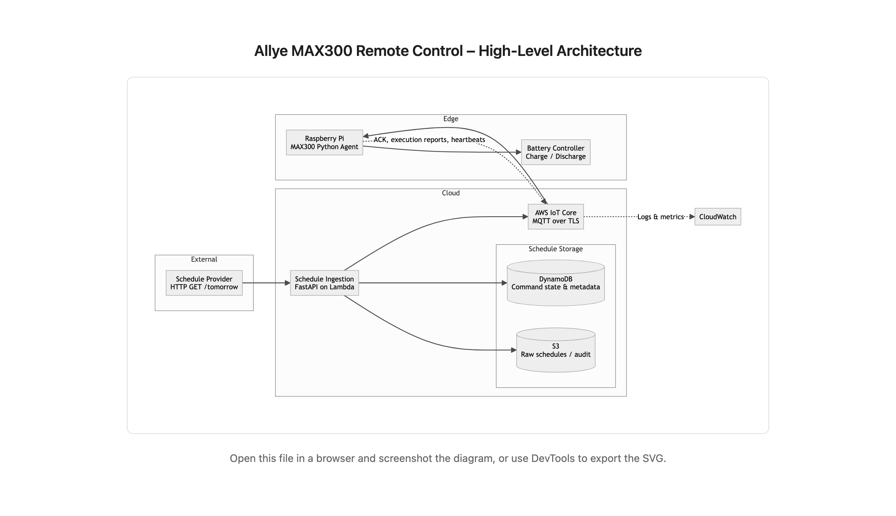
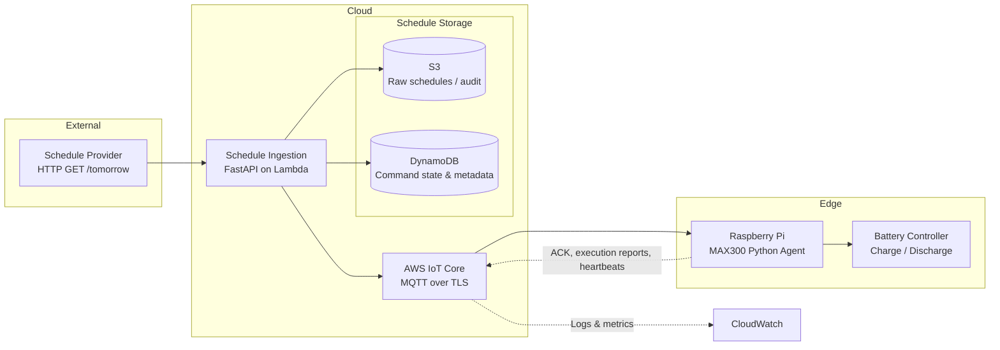
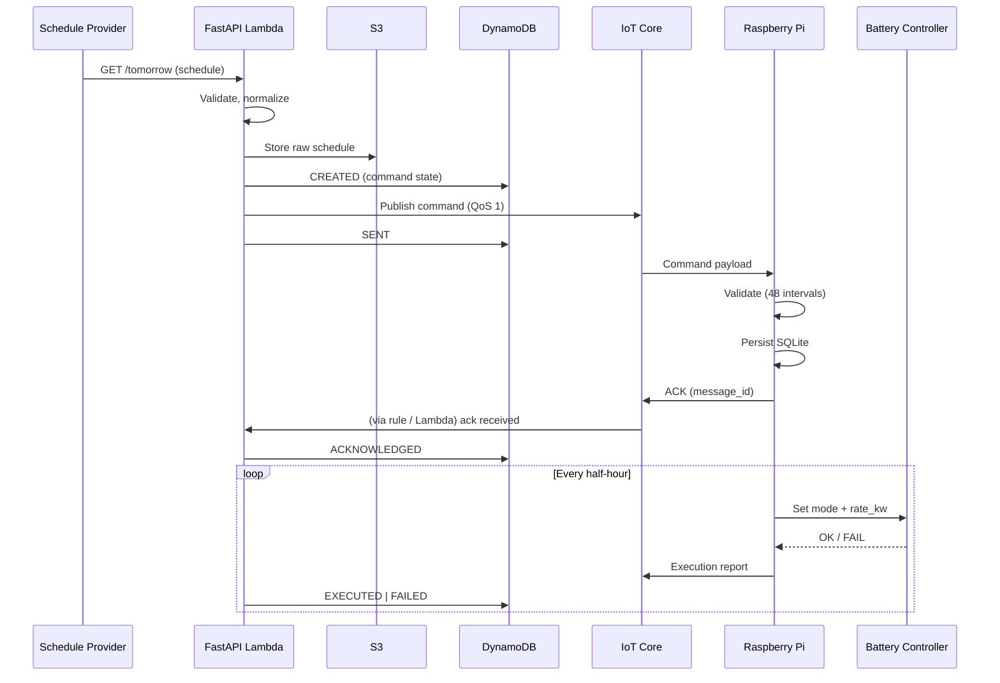

# Allye MAX300 Remote Control & Scheduling System

**Author:** Victor Ibhafidon  
**Date:** 29/01/2026  
**Status:** Design Proposal

---

## 1. Overview

This system delivers day-ahead charge/discharge schedules to Allye MAX300 batteries via Raspberry Pi agents. Goals: secure delivery, reliable execution, traceability, low operational overhead, and linear scalability to 10,000+ devices.

---

## 2. Functional Requirements

- Fetch schedules from external provider (`GET /tomorrow`)
- Deliver schedules securely to devices
- Validate and execute schedules on Raspberry Pi
- End-to-end observability: sent to acknowledged to executed

---

## 3. Non-Functional Requirements

- TLS-secured device communication
- At-least-once command delivery (MQTT QoS 1)
- Offline resilience (device persists last valid schedule)
- Low operational overhead; easy iteration

---

## 4. High-Level Architecture



*Figure 1: Data flow from Schedule Provider through cloud ingestion, storage, IoT Core, to the Raspberry Pi agent and battery controller. Dashed lines show feedback (ACKs, execution reports, heartbeats) and observability (CloudWatch).*

**Components:**

1. **External Schedule Provider** – HTTP GET returns JSON schedule.
2. **Cloud Ingestion (FastAPI Lambda)** – validates, normalizes, generates messages.
3. **Schedule Storage** – S3 (raw schedules/audit), DynamoDB (command state/acks).
4. **IoT Messaging (AWS IoT Core, MQTT/TLS)** – per-device topics, reliable delivery.
5. **Edge Device (Raspberry Pi)** – Python agent: MQTT client, validator, local SQLite store, execution engine, telemetry reporter.
6. **Battery Controller** – executes mode/rate_kw commands.

**Feedback & Observability:** Pi to IoT Core: ACKs, execution reports, heartbeats to CloudWatch logs/metrics.

**Architecture flowchart (Mermaid):**



**Command flow (sequence):**



**Component boxes (Excalidraw):** Box 1 – Schedule Provider (External Schedule API, HTTP GET `/tomorrow`). Box 2 – FastAPI (AWS Lambda): fetch, validate, normalize, generate commands. Box 3 – Schedule Storage: S3 (raw/audit), DynamoDB (command state & metadata). Box 4 – AWS IoT Core (MQTT over TLS): per-device topics, QoS, cert auth. Box 5 – MAX300 Python Agent: MQTT Client, Schedule Validator, Local Store (SQLite), Execution Engine, Telemetry Reporter. Box 6 – Battery Controller (Charge/Discharge Interface). Dashed arrows: Pi to IoT Core (ACKs, reports, heartbeats); IoT Core to CloudWatch (logs/metrics).

---

## 5. Protocols & Communication

| Direction              | Protocol                      | Rationale                                          |
| ---------------------- | ----------------------------- | -------------------------------------------------- |
| Cloud to Device        | MQTT over TLS                 | IoT-friendly, reliable, cert-based, low-overhead   |
| Device to Cloud        | MQTT (acks/reports/heartbeat) | Same broker, lightweight                           |
| Bootstrap/Diagnostics  | HTTPS                         | Optional, for certificate renewal or large configs |

---

## 6. Message Format

**Design choices:** JSON for readability and iteration; versioned schema (`schema_version`); unique `message_id` for idempotency and traceability. Provider `mode` 1 = DISCHARGE, 2 = CHARGE. Exactly 48 half-hour intervals per day.

**Schedule command (cloud to device):**

```json
{
  "message_id": "550e8400-e29b-41d4-a716-446655440000",
  "device_id": "allye-max300-001",
  "schedule_date": "2025-12-25",
  "intervals": [
    {"start_time": "2025-12-25T00:00:00Z", "end_time": "2025-12-25T00:30:00Z", "mode": "DISCHARGE", "rate_kw": 100},
    {"start_time": "2025-12-25T00:30:00Z", "end_time": "2025-12-25T01:00:00Z", "mode": "CHARGE", "rate_kw": 10},
    "... 46 more intervals ...",
    {"start_time": "2025-12-25T23:30:00Z", "end_time": "2025-12-26T00:00:00Z", "mode": "DISCHARGE", "rate_kw": 30}
  ],
  "issued_at": "2025-12-24T12:01:00Z",
  "schema_version": "v1"
}
```

**ACK – accepted:**

```json
{"message_id": "550e8400-e29b-41d4-a716-446655440000", "device_id": "allye-max300-001", "ack_at": "2025-12-24T12:01:05Z", "status": "ACCEPTED", "schema_version": "v1"}
```

**ACK – rejected:**

```json
{"message_id": "550e8400-e29b-41d4-a716-446655440000", "device_id": "allye-max300-001", "ack_at": "2025-12-24T12:01:05Z", "status": "REJECTED", "reject_reason": "Expected 48 intervals, got 47", "schema_version": "v1"}
```

**Execution report – success:**

```json
{"message_id": "550e8400-e29b-41d4-a716-446655440000", "device_id": "allye-max300-001", "start_time": "2025-12-25T00:00:00Z", "end_time": "2025-12-25T00:30:00Z", "reported_at": "2025-12-25T00:30:01Z", "result": "EXECUTED", "schema_version": "v1"}
```

**Execution report – failure:**

```json
{"message_id": "550e8400-e29b-41d4-a716-446655440000", "device_id": "allye-max300-001", "start_time": "2025-12-25T00:00:00Z", "end_time": "2025-12-25T00:30:00Z", "reported_at": "2025-12-25T00:05:00Z", "result": "FAILED", "error_code": "BMS_FAULT", "schema_version": "v1"}
```

**Heartbeat:**

```json
{"device_id": "allye-max300-001", "sent_at": "2025-12-25T00:15:00Z", "current_interval_start": "2025-12-25T00:00:00Z", "schema_version": "v1"}
```

**MQTT topics:** Commands `devices/{device_id}/commands`; ACKs `devices/{device_id}/acks`; Execution reports `devices/{device_id}/reports`; Heartbeats `devices/{device_id}/heartbeat`. Cloud subscribes (or uses IoT Core rules) to update DynamoDB and CloudWatch.

---

## 7. Cloud Services

| Concern       | Service                | Reason                                      |
| ------------- | ---------------------- | ------------------------------------------- |
| Compute/API   | FastAPI on Lambda      | Stateless, pay-per-use, low ops             |
| Messaging     | AWS IoT Core           | Managed MQTT, scaling, cert-based auth     |
| Storage       | S3 + DynamoDB          | Audit/raw storage + fast command state/acks |
| Observability | CloudWatch + X-Ray     | Logs, metrics, tracing end-to-end            |
| Auth          | IoT X.509 certificates | Device identity, no shared secrets           |

---

## 8. Edge Responsibilities

- Subscribe to device MQTT topic
- Validate schedule completeness and format (48 half-hour intervals)
- Persist schedules locally (SQLite)
- Execute intervals according to system time (NTP-synced)
- Report ACKs, execution results, and heartbeats

Offline resilience: continue last valid schedule until connectivity returns.

---

## 9. Observability & Traceability

**Lifecycle:** `CREATED -> SENT -> ACKNOWLEDGED -> EXECUTED | FAILED`

- **Logging:** Structured by `message_id` and `device_id` (cloud + edge)
- **Metrics:** Delivery latency, execution success, heartbeat freshness
- **Debugging at scale:** Filter by `message_id`, `device_id`, or time window; isolate failures at ingestion, delivery, or execution stage

**Observability flow:** Lambda logs, IoT Core logs, Pi agent logs to CloudWatch Logs and Metrics; Lambda to X-Ray for tracing. All keyed by `message_id` and `device_id`.

---

## 10. Scaling Considerations

- Partitioned MQTT topics per device prevent fan-out bottlenecks
- Stateless cloud services (Lambda, IoT Core, DynamoDB) scale horizontally
- Costs roughly linear with devices/messages
- Mitigations: batch publishing, rate-limiting, dead-letter queues

---

## 11. Future Improvements

- Protobuf for compact payloads
- Command batching for large fleets
- Device shadow/state reconciliation
- Canary schedule rollouts
- Advanced anomaly detection on execution/heartbeat

---

## 12. Document contents

This document covers: high-level architecture and diagram (Section 4), protocols and message format (Sections 5–6), cloud services and edge responsibilities (Sections 7–8), observability and scaling (Sections 9–10), and future improvements (Section 11).
