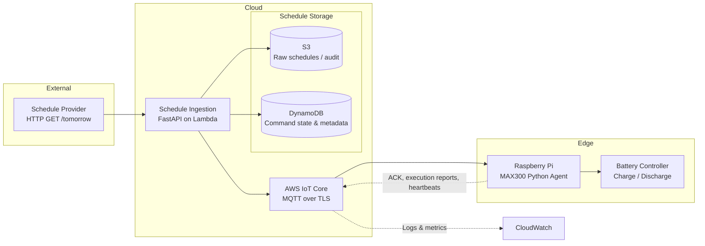
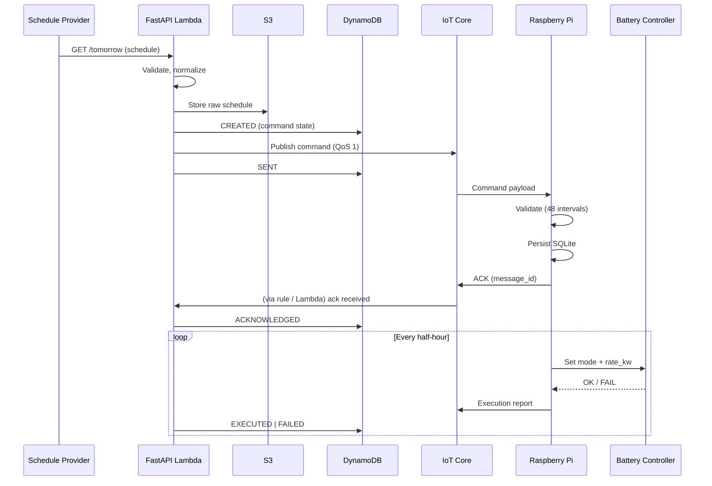
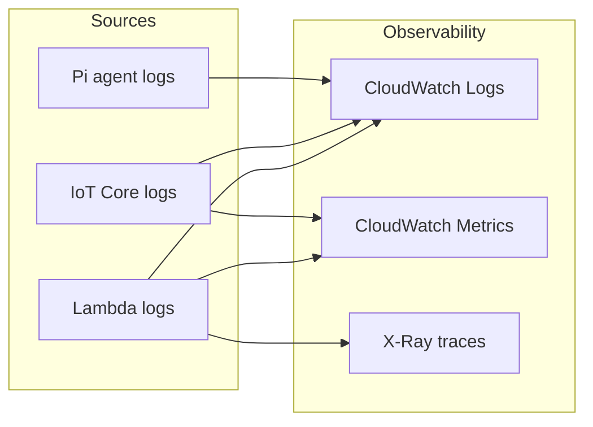

# Allye MAX300 System Architecture

Diagram source. The design doc ([DESIGN_PROPOSAL.md](./DESIGN_PROPOSAL.md)) embeds the flowchart and sequence diagram in Section 4.

---

## High-Level Flow (Left to Right)

---

## Component Boxes (for Excalidraw)

Use these as labels when drawing in Excalidraw.

### Box 1: Schedule Provider
- **Label:** External Schedule API
- **Notes:** HTTP GET `/tomorrow`; returns JSON schedule for next day.

### Box 2: Schedule Ingestion Service
- **Label:** FastAPI (AWS Lambda)
- **Responsibilities:** Fetch schedule; validate JSON; normalize intervals; generate command messages; publish to IoT Core.

### Box 3: Schedule Storage
- **S3:** Raw schedules and audit logs.
- **DynamoDB:** Command state, metadata, acknowledgements, execution results.

### Box 4: IoT Messaging Layer
- **Label:** AWS IoT Core (MQTT over TLS)
- **Notes:** Per-device topics; QoS enabled; certificate-based auth.

### Box 5: Raspberry Pi (Edge Device)
- **Label:** MAX300 Python Agent
- **Sub-components:** MQTT Client; Schedule Validator; Local Store (SQLite); Execution Engine; Telemetry Reporter.

### Box 6: Battery Controller
- **Label:** Charge / Discharge Interface
- **Notes:** Hardware interaction layer (mode + rate_kw).

**Feedback (dashed arrows):** Raspberry Pi to IoT Core: ACK messages, execution reports, heartbeats. IoT Core / Lambda to CloudWatch: logs and metrics.

---

## Command Flow (Sequence)

---

## Observability Flow

All logs and traces are keyed by `message_id` and `device_id` for cross-filtering when debugging at scale.
